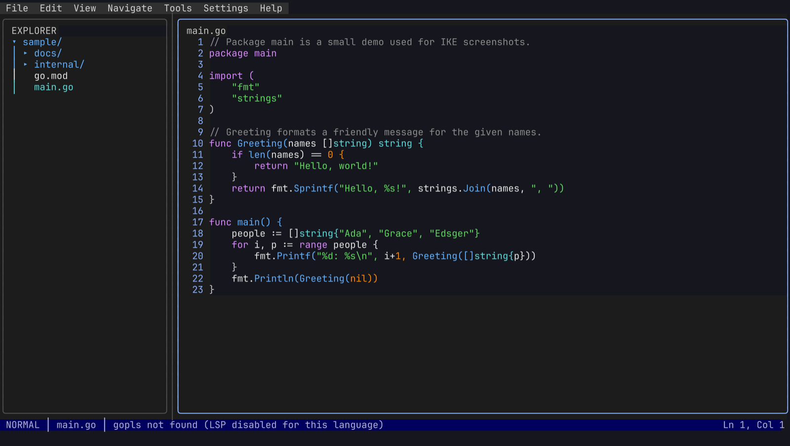
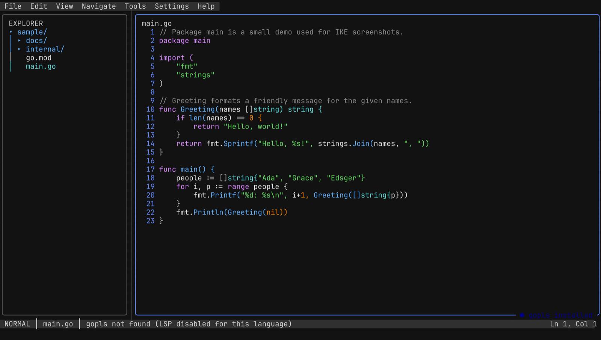
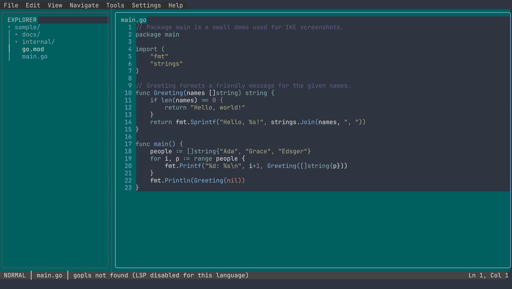
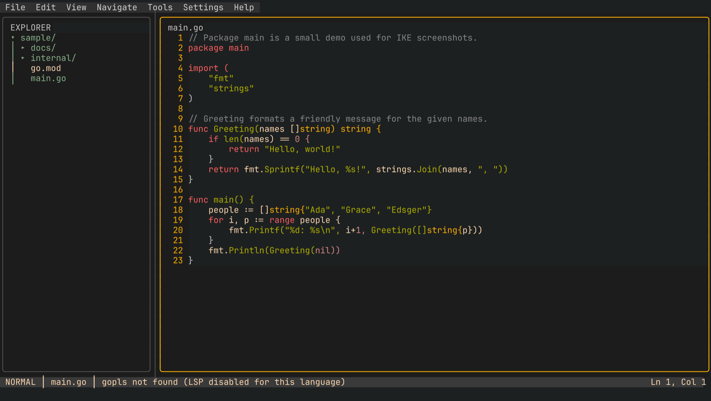
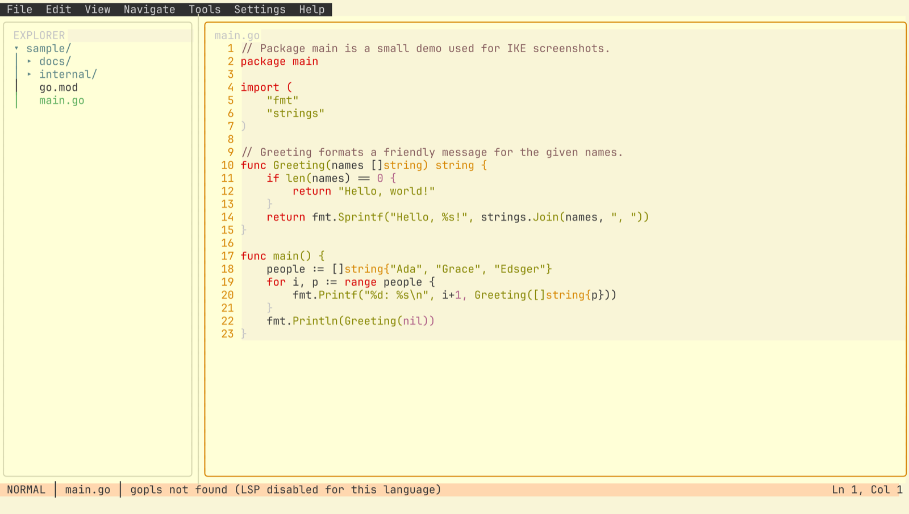
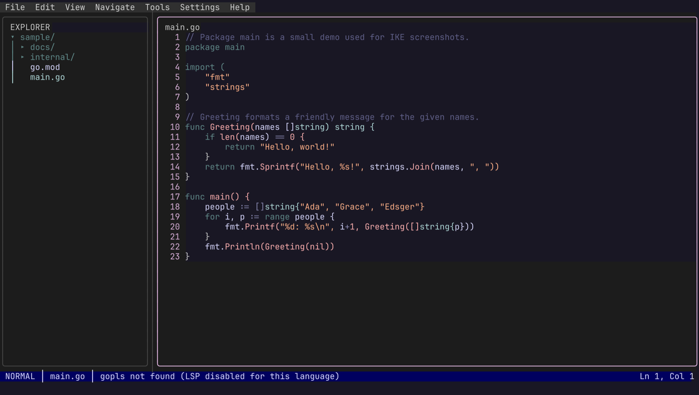
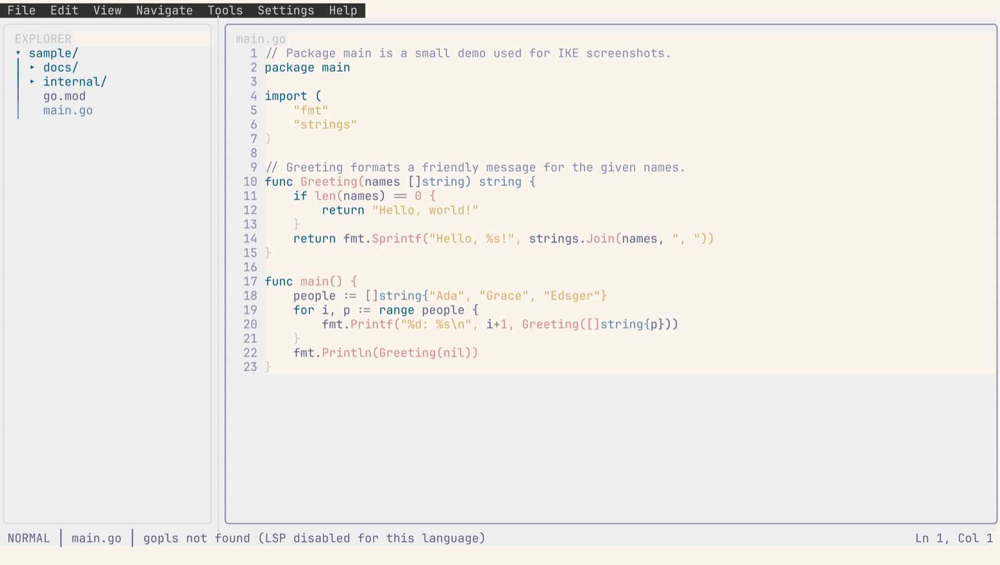
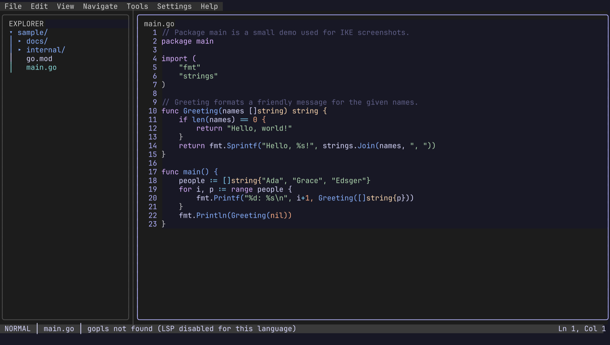
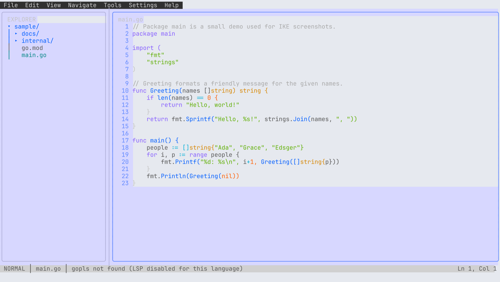

# IKE

**IKE** is a terminal IDE — a JetBrains-inspired TUI built with
[bubbletea](https://github.com/charmbracelet/bubbletea), with vim-like controls
in the editor. It brings the pieces you expect from a desktop IDE into the
terminal: a file explorer, multiple editor panes with tabs, a command palette,
LSP-powered language intelligence, Tree-sitter syntax highlighting, an
integrated terminal, themes, and a WASM plugin system.



## Installation & usage

IKE is a single Go binary. You need [Go 1.26+](https://go.dev/dl/) and a
terminal with truecolor, mouse, and Kitty keyboard protocol support
(see [Platform notes](#platform-notes)).

Build from source (all platforms):

```sh
git clone https://github.com/TrueDaerk/ike.git
cd ike
go build -o ike ./cmd/ike
```

Then run `ike` from the directory you want to open as a project — the current
working directory becomes the project root:

```sh
cd ~/src/my-project
ike
```

Files can be opened directly from the command line — as tabs, optionally at a
line (and column); the vim-style `+N` form works too, and a path that does not
exist yet opens as a new unsaved buffer:

```sh
ike internal/app/app.go:725       # open at line 725
ike main.go:10:4 README.md        # two tabs, first one focused at 10:4
ike +42 main.go                   # vim-style line prefix
git log | ike -                   # pipe stdin into a scratch buffer
```

### Platform notes

> [!IMPORTANT]
> IKE only works properly in a terminal that supports the
> [Kitty keyboard protocol](https://sw.kovidgoyal.net/kitty/keyboard-protocol/)
> **and** has its own keybindings (mostly) disabled — otherwise the terminal
> swallows chords before they ever reach IKE. For example, with
> [Ghostty](https://ghostty.org/) use a config like:
>
> ```
> keybind = clear
> keybind = super+,=open_config
> keybind = super+shift+,=reload_config
> # macOS only: Option is a composition key (needed for { [ @ ~ on
> # international layouts), so option+backspace arrives without the alt
> # modifier. This sends ESC DEL directly (backward-kill-word in IKE and
> # in shells). Must come *after* `keybind = clear`.
> keybind = alt+backspace=text:\x1b\x7f
> ```
>
> (on Windows/Linux use `ctrl` instead of `super`.) Ghostty merges every
> config file it finds (e.g. `~/.config/ghostty/config` **and**
> `~/Library/Application Support/com.mitchellh.ghostty/config.ghostty`);
> a `keybind = clear` in a later file wipes keybinds from earlier ones —
> check the effective result with `ghostty +show-config`.

| Platform | Notes |
|---|---|
| **Linux** | Works in terminals with Kitty keyboard protocol support (Ghostty, kitty, wezterm, foot, Alacritty, …). Put the binary on your `PATH`, e.g. `install ike ~/.local/bin/`. |
| **macOS** | Works in Ghostty, kitty, wezterm, iTerm2 (3.5+), Alacritty, …. Install with `go build -o /usr/local/bin/ike ./cmd/ike` (or any `PATH` directory). |
| **Windows** | Build with `go build -o ike.exe ./cmd/ike` and run in a terminal with Kitty keyboard protocol support (e.g. wezterm). WSL2 also works well — follow the Linux notes there. |

### Optional tools

IKE degrades gracefully without these, but they unlock extra features:

- [`ripgrep`](https://github.com/BurntSushi/ripgrep) (`rg`) — fast backend for
  project-wide search (a pure-Go fallback is built in).
- **Language servers** for code intelligence, per language: `gopls` (Go),
  `pyright-langserver` (Python), `intelephense` (PHP). IKE detects them on
  your `PATH` and disables LSP per language when missing.

### Configuration

Settings live in TOML, merged as *defaults < user < project*:

- User: `~/.ike/settings.toml` (or `$IKE_CONFIG_DIR/settings.toml`)
- Project: `<project>/.ike/settings.toml`

```toml
[theme]
name = "tokyo-night"
```

Most settings can also be edited interactively in the settings panel
(menu bar → Settings), and config changes are picked up live — no restart.

## Features

- **Pane layout** — split the workspace into any arrangement of panes; resize
  by dragging dividers and move panes by dragging their title bars (full mouse
  support). The layout persists per project.
- **Editor tabs** — each editor pane holds an ordered set of tabs; buffers are
  shared across panes.
- **Vim-like modal editor** — normal/insert/visual modes, motions, operators,
  text objects, registers, undo/redo, and in-buffer search.
- **Command palette** — `ctrl+p` opens a centered overlay: type `:` to run any
  registered command (context-ranked), or `@` to fuzzy-find files.
- **JetBrains-like keybindings** — context-scoped shortcuts with multi-step
  chords, conflict detection, platform normalisation, and a built-in
  cheatsheet (help overlay).
- **File explorer** — directory tree pane with per-filetype colors.
- **Syntax highlighting** — Tree-sitter grammars, parsed off the UI loop and
  colored by the active theme.
- **LSP integration** — diagnostics, completion, hover, and go-to-definition
  over a language server's stdio, managed per (language, project root).
- **Project search** — streaming find-in-path with an `rg --json` backend and
  a pure-Go fallback.
- **Integrated terminal** — a real PTY-spawned shell in a pane, with raw key
  routing (`ctrl+arrows` escape back to the IDE), mouse passthrough, and text
  selection.
- **Themes** — one `[theme].name` recolors the whole IDE; nine built-ins plus
  plugin-registered themes, switchable live from the palette
  (see [screenshots](#themes) below).
- **Session restore & crash recovery** — open files, cursors, and explorer
  state are restored per project; dirty buffers are snapshotted vim-swapfile
  style and offered back after a crash.
- **Project switching** — recent-projects history for jumping between
  workspaces.
- **Scratch files** — language-aware throwaway buffers ("New Scratch File:
  Python" in the palette), stored outside the project tree and surviving
  restarts.
- **Navigation history** — JetBrains-style Back/Forward across cursor jumps.
- **Settings UI & menu bar** — schema-driven settings forms with config
  write-back, and a menu bar fronting the command registry.
- **Plugins** — compile-in Go plugins and sandboxed **WASM plugins** (with a
  Go guest SDK) can add commands, themes, and languages. Adding a language is
  one new package: extensions + grammar + LSP server + toolchain detection.

The `wiki/` directory contains the full architecture documentation, one
concept document per subsystem.

## Themes

Select a theme in `settings.toml` (`[theme] name = "..."`) or at runtime via
the command palette (`:` → "Theme: …"). Built-ins:

| | |
|---|---|
| **default**  | **tokyo-night**  |
| **nord**  | **gruvbox**  |
| **gruvbox-light**  | **rose-pine**  |
| **rose-pine-dawn**  | **catppuccin-mocha**  |
| **catppuccin-latte**  | |

## Development

- Planning lives in [GitHub issues](https://github.com/TrueDaerk/ike/issues)
  (epics + sub-issues, one milestone per epic) — see `CLAUDE.md` for the
  workflow.
- Run the tests with `go test ./...`.
- Architecture docs live in [`wiki/`](wiki/index.md).
