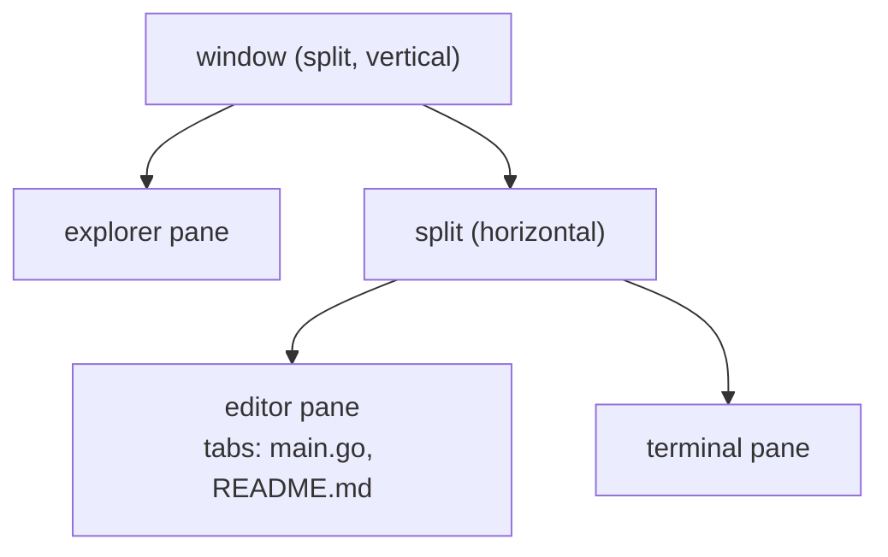

# Panes, tabs and layouts

IKE's window is a **split tree**. There is no fixed sidebar-plus-editor
arrangement: every region is a pane, every pane can be split, and any pane can
end up anywhere.

All screenshots on this page use the `monokai-pro` theme.

Read that window as a tree — a vertical split whose left child is the explorer
and whose right child is the editor:

Nothing about that shape is fixed. The explorer can sit on the right, the
terminal can be a tab inside the editor pane, and any leaf can be split again.

## The pieces

**Pane** — one rectangle holding one thing: the file tree, an editor, or a tool
window. Panes tile the window exactly; there is no gap between them, and the
seam you see is the two panes' own borders meeting.

**Split** — a pane divided in two, either side by side or stacked, at a ratio
you can drag. Splitting a split is how you get arbitrary arrangements.

**Tab** — editor panes hold an ordered list of tabs. Terminals live in tabs
too, so a pane can hold a mix of files and shells.

**Focus** — exactly one pane has it, and its border is drawn in the accent
colour. It decides which keybindings are active (the
[keybinding reference](../reference/keybindings.md) is grouped by context),
which pane a newly opened file lands in, and what most commands act on.

These four words mean the same thing on every page of this documentation, as
do the two that name what fills a pane:

| Word | What it names |
|---|---|
| **Tool window** | A built-in pane IKE opens for you: the explorer, Structure, Problems, the TODO index, the VCS window, the debug window |
| **Tool pane** | A pane running a TUI program you configured under `[[tools.custom]]` — `lazygit`, `htop` |

Overlays — the palette, the settings panel, the cheatsheet — are neither: see
[What is *not* a pane](#what-is-not-a-pane).

## Splitting and moving

| Keys | What it does |
|---|---|
| ++cmd+k++ then ++left++ / ++right++ / ++up++ / ++down++ | Split the focused pane in that direction |
| ++cmd+k++ then ++z++ | Maximize the focused pane, and back |
| ++ctrl+alt+r++ | Resize the focused pane (see below) |
| ++ctrl+tab++ | Cycle pane focus (++ctrl++ + arrows moves directionally) |
| ++cmd+shift+f12++ | Hide all tool windows |
| ++shift+f12++ | Restore the default layout |

Every one of those acts on the **focused** pane, whichever type it is.
**Split View Right** (++cmd+alt+shift+right++) is the editor-specific variant:
with an editor pane focused it puts the same buffer in a second pane next to
the first.

### Resizing without the mouse

++ctrl+alt+r++ (or **Resize…** in a title bar's context menu) starts **resize
mode**: you type the chord *once*, then ++h++ ++j++ ++k++ ++l++ — or the arrow
keys — move the focused pane's edge one cell per press, as often as you like.
++esc++ or ++enter++ leaves the mode; the status line shows `RESIZE` with the
pane's name while it is on, and nothing else you type does anything, so a
forgotten mode can never edit a file.

The keys say **where the edge moves**, not "bigger" or "smaller": ++l++ moves
it right, ++j++ moves it down. A pane with a neighbour to its right therefore
grows with ++l++ and shrinks with ++h++; the rightmost pane, whose only edge is
on its left, reads the other way round. Panes never shrink away entirely — the
same minimum size the mouse drag respects applies here.

With the mouse: drag a divider to resize, drag a pane's title bar to move the
pane somewhere else, right-click a title bar for the pane's context menu. A
drag only engages after the pointer travels a little, so a plain click on a
title bar just focuses.

!!! note "`ctrl+tab` inside tmux"
    tmux consumes ++ctrl+tab++ for its own tab switching and never forwards
    it. Use the arrow variants, or rebind `pane.switcher`.

## Tabs

Tabs belong to a pane, not to the window. Opening a file routes it into the
**focused** pane's tab list, so where your focus is decides where the file
lands.

| Keys | What it does |
|---|---|
| ++cmd+ctrl+right++ / ++cmd+ctrl+left++ | Next / previous tab |
| ++alt+1++ … ++alt+9++ | Jump to tab *n* |
| ++ctrl+shift+page-up++ / ++ctrl+shift+page-down++ | Move the current tab left / right |
| ++cmd+w++ | Close the active tab |
| ++cmd+shift+t++ | Reopen the last closed tab |

### The tab limit

`editor.tabs.limit` (default `5`) caps the document tabs per pane,
JetBrains-style: opening a file beyond the limit closes the least recently used
tab instead of growing the bar forever. Set it to `0` to disable the cap.

Eviction never costs you anything you cannot get back. Exempt from it are the
active tab, tabs with unsaved changes, scratch tabs (there is no path to reopen
them from), terminal tabs, and **pinned** tabs. If nothing is eligible — every
other tab pinned, say — the limit is simply exceeded rather than something
being closed that should not be. Evicted tabs go into the reopen ring, so
++cmd+shift+t++ brings them back.

Pin a tab with **Pin/Unpin Tab** from the palette or the tab context menu. A
pinned tab is exempt from eviction and survives the close-others actions.

## Buffers are shared

The same file open in two panes is one buffer, not two copies: type in one and
the other updates, and it is dirty or clean in both. Closing one tab does not
discard the content the other still shows.

That is what makes a split-with-the-same-file useful — two viewports, one
document, each with its own cursor and scroll position.

## Layouts persist

The arrangement is saved **per project**: reopen a project and the panes, the
splits and their ratios come back the way you left them.

Beyond that you can name arrangements:

- **Save Window Layout…** stores the current arrangement under a name. Before
  naming it you pick the panes the layout should pin on a map of the current
  arrangement — arrows or ++h++/++j++/++k++/++l++ move, ++space++ or a mouse
  click toggles, ++enter++ continues. Pinned panes are highlighted in the
  selection color; dim panes are not stored: when you later apply the layout,
  whatever is open in panes the layout does not pin spreads over the
  remaining space, keeping its current arrangement.
- **Window Layouts…** opens a picker to apply one.
- **Set Default Window Layout…** marks one as the layout new projects start from.
- ++shift+f12++ restores the default layout when a session has drifted.

Applying a layout never folds your open panes into tabs: editors and running
terminals that have no slot in the layout keep their own panes and move into
the flexible space — next to the layout's editor area when the layout pins
every pane — preserving how they were arranged. Tool panes such as lazygit
never absorb other terminals.

Named layouts are user-scoped, so they follow you across projects. A saved
layout that no longer makes sense — a pane type that is gone, a window that
shrank — degrades rather than failing; you never lose a pane to a stale
layout.

## What is *not* a pane

Overlays are not part of the tree and do not disturb it: the command palette,
the help cheatsheet, the settings panel, the welcome tour and confirmation
dialogs all float above the layout and give focus back when they close.
