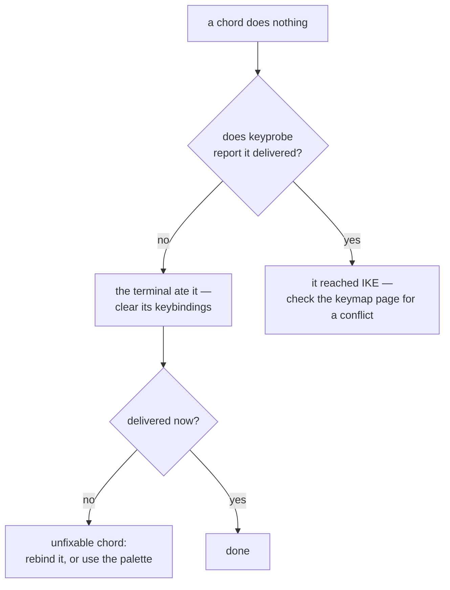

# Terminal setup

Read this one. Nearly every "IKE ignores my keyboard" report is a terminal
that never forwarded the key.

## Why this is necessary

A terminal traditionally sends characters, not key events. `Ctrl+S` and
`Cmd+Shift+O` and `Alt+F7` have no representation in that model — the terminal
either swallows them, rewrites them, or sends something ambiguous. The
[Kitty keyboard protocol](https://sw.kovidgoyal.net/kitty/keyboard-protocol/)
fixes that by reporting real key events with real modifiers.

IKE is built on JetBrains-style modifier chords, so it needs the protocol. Two
conditions have to hold:

1. Your terminal **supports** the protocol.
2. Your terminal does not **claim the chord for itself** before passing it on.

The second one bites more often than the first.

## Terminals that work

| Terminal | Platform | Where its own shortcuts are cleared |
|---|---|---|
| [Ghostty](https://ghostty.org/) | macOS, Linux | `keybind = clear` |
| kitty | macOS, Linux | `clear_all_shortcuts yes` |
| WezTerm | macOS, Linux, Windows | `disable_default_key_bindings = true` |
| foot | Linux | Its `[key-bindings]` section |
| Alacritty | macOS, Linux, Windows | Its keyboard-bindings config |
| iTerm2 3.5+ | macOS | Its Keys preferences |

On Windows, WezTerm is the reliable choice; Windows Terminal does not
implement the protocol.

Inside `tmux` some chords are lost regardless — `ctrl+tab` in particular is
consumed by tmux and never forwarded.

When a chord does nothing, this is the order to work through:



## Freeing up the chords

Clear the terminal's own keybindings so they stop shadowing IKE's. For
Ghostty:

```ini
keybind = clear
keybind = super+,=open_config
keybind = super+shift+,=reload_config
```

`keybind = clear` wipes everything, then the two lines add back the config
shortcuts you still want. Off macOS use `ctrl` instead of `super`.

!!! warning "Ghostty merges config files"
    Ghostty reads every config file it finds — for example
    `~/.config/ghostty/config` **and**
    `~/Library/Application Support/com.mitchellh.ghostty/config.ghostty`. A
    `keybind = clear` in a later file wipes the keybinds set in an earlier
    one. Check what actually took effect:

    ```sh
    ghostty +show-config
    ```

For other terminals the equivalent is whatever removes their own shortcuts —
kitty's `clear_all_shortcuts yes`, WezTerm's `disable_default_key_bindings =
true`.

## macOS: the Option key

On international layouts macOS uses Option as a composition key — it is how
you type `{ [ @ ~`. That means ++alt+backspace++ arrives at IKE *without* the
alt modifier, and the backward-kill-word binding never fires.

Send the escape sequence explicitly. This line must come **after**
`keybind = clear`:

```ini
keybind = alt+backspace=text:\x1b\x7f
```

The same trick works for any other Option chord you want back: bind it to the
literal bytes the application expects.

## Verifying with keyprobe

The repository ships a probe that answers "did this key reach the program?"
definitively.

```sh
go run ./cmd/keyprobe
```

It lists the chords IKE cares about. Press them, then quit with ++ctrl+d++. On
exit it prints one `PROBE` line per chord — delivered or missing, and what
actually arrived when the terminal rewrote it.

A chord reported missing there never reached IKE either. No amount of
rebinding inside IKE will fix it; the fix belongs in the terminal
configuration.

## If a chord is unfixable

Some chords cannot be rescued — the OS claims them, or the terminal has no way
to send them. That is not a dead end:

- **Rebind it.** Every command can be bound to a different chord; see the
  [keybinding reference](../reference/keybindings.md).
- **Use the palette.** Everything IKE can do is reachable by name from
  **Search everywhere** (++shift++ twice), with no chord involved.
- **Use the vim keys.** In the editor, the vim motions, operators and
  ex-commands work regardless of what the chord table says — `:w` saves
  whether or not ++cmd+s++ arrives.
