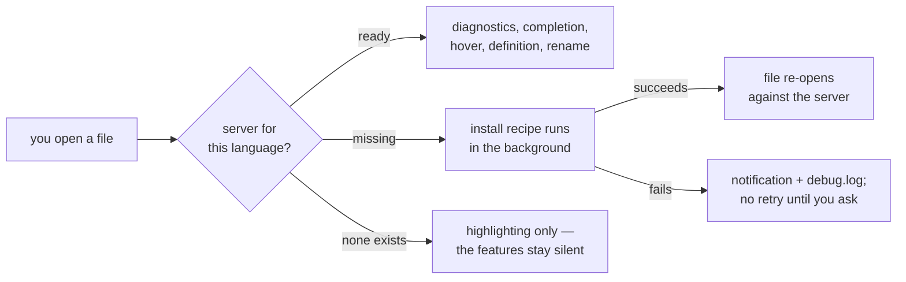

# Code intelligence

Diagnostics, completion, hover, jump-to-definition, find-usages and rename all
come from a **language server** — a separate program that understands your
language. IKE speaks LSP to it; it does not implement any of this itself.

That has one practical consequence: everything on this page depends on a
server being available for the language you are editing. When there is none,
the features go quiet rather than breaking.



## Which server for which language

| Language | Server | Installed with |
|---|---|---|
| Go | `gopls` | `go install golang.org/x/tools/gopls@latest` |
| Python | `pyright-langserver` | `npm install -g pyright` |
| PHP | `intelephense` | `npm install -g intelephense` |
| TypeScript / JavaScript / web | `vtsls` | `npm install -g @vtsls/language-server` |
| JSON | `vscode-json-language-server` | `npm install -g vscode-langservers-extracted` |
| YAML | `yaml-language-server` | `npm install -g yaml-language-server` |
| TOML | `taplo` | `npm install -g @taplo/cli` |
| Shell | `bash-language-server` | `npm install -g bash-language-server` |
| SQL | `sqls` | `go install github.com/sqls-server/sqls@latest` |
| Markdown | `marksman` | `brew install marksman` |
| Dockerfile | `docker-langserver` | `npm install -g dockerfile-language-server-nodejs` |
| Ansible | `ansible-language-server` | `npm install -g @ansible/ansible-language-server` |

Shell diagnostics additionally need `shellcheck` — `bash-language-server`
delegates linting to it.

## Installation happens on its own

You normally do not run those commands yourself.

On the **first launch** IKE offers a dialog listing every language whose
server it knows how to install, all pre-checked. Enter installs them; ++esc++
skips. Anything you uncheck is remembered as disabled and left alone
afterwards.

After that, **activation implies installation**: open a file in a language
whose server is missing and IKE runs the install recipe in the background,
tells you it is doing so, and re-opens the file when the server is ready.

Guard rails, so this never becomes a nuisance:

- One install per language at a time.
- A failed automatic install backs off **permanently** — it will not retry on
  every file open. The manual path is the retry.
- Failures show the tail of the install output and write a line to
  `debug.log`.
- Success is only claimed once the binary actually resolves. A recipe that
  exits cleanly but installs somewhere off your `PATH` is reported as a
  failure, naming the directories that were probed.

Set `lsp.auto_install = false` to turn all of this off. Then
**LSP: Install Missing Servers** from the palette, or `i` on the
**Language Servers** settings page, is how you install one deliberately.

## What you get

| Keys | What it does |
|---|---|
| ++f4++ | Go to definition (++cmd+b++ also) |
| ++alt+f7++ | Find usages |
| ++ctrl+q++ | Quick documentation for the symbol at the cursor |
| ++cmd+p++ | Parameter info while writing a call |
| ++alt+enter++ | Intention actions / quick fixes |
| ++shift+f6++ | Rename the symbol everywhere |
| ++cmd+alt+l++ | Reformat the file |
| ++ctrl+alt+h++ | Call hierarchy |
| ++f2++ / ++shift+f2++ | Next / previous diagnostic |
| ++ctrl+f1++ | Show the diagnostic under the cursor in full |
| ++cmd+o++ | Go to symbol across the project |
| ++cmd+8++ | The Problems window — every diagnostic in the project |

Completion appears as you type; ++enter++ accepts, ++esc++ dismisses.
**LSP: Peek Definition** shows a definition inline without leaving the file,
and **LSP: Find Usages (Panel)** puts the results in a tool window rather than
a popup.

Every chord in that table needs an **editor pane focused**, except ++cmd+o++
and ++cmd+8++, which work from anywhere.

Diagnostics are shown three ways at once:

| Where | What you see |
|---|---|
| In the text | The offending range underlined, in the severity's colour |
| In the scrollbar | A mark per diagnostic, so off-screen ones are still visible |
| In the Problems window (++cmd+8++) | Every diagnostic in the project, grouped by file, errors first |

Too strict? `lsp.diagnostics_severity` remaps what a rule counts as: each
entry names a diagnostic rule and the severity you want — for example
`reportArgumentType warning` turns pyright's argument-type errors into
warnings, and `reportUnusedImport off` hides that rule entirely. The full
form takes the same `source=` / `code=` / `msg=` glob conditions as the
ignore rules, with the severity keyword (`error`, `warning`, `info`, `hint`,
`off`) last; the first matching rule wins. Real syntax errors always stay
errors. For pyright the exact-rule entries are also handed to the server
itself (its native `diagnosticSeverityOverrides`), for every other server IKE
remaps what the server publishes — either way the editor and the Problems
window agree, and edits to the rules apply immediately.

One more knob for type checkers: the `partial` keyword restricts a rule to
**union-partial** type mismatches — an argument inferred as `str | None`
passed where `str` is expected is usually the realistic branch being fine,
unlike a completely wrong type. So
`source=pyright reportArgumentType partial warning` demotes only those,
while a genuine mismatch (`int` where `str` is expected) stays an error.
Pair `partial` with `source=` — it parses the server's message phrasing,
which differs between servers (pyright is the tested one).

## On save

Two settings, both off by default, both applying to **manual** saves only —
auto-save deliberately never reformats under you:

| Setting | What it does |
|---|---|
| `editor.format_on_save` | Runs the reformat chain (external tool, server or built-in formatter) before writing |
| `editor.organize_imports_on_save` | Applies the organize-imports action before writing |

## Reformatting

++cmd+alt+l++ (**Reformat File**) is not tied to the language server: IKE
resolves a chain per buffer — an explicit `[format.<language>]` override from
your config, then the language plugin's external tool, then the server's
formatter, then a built-in one — and the status line names what ran
(`reformat: ruff`, `reformat: gopls`). A missing tool produces a one-time
install hint; a failing tool leaves the buffer untouched and shows its error.
**Reformat Selection** works where the winning source supports ranges and
says so when only whole-file reformat is available. See the
[settings reference](../reference/settings.md#formatters) for configuring a
formatter per language or project.

SQL reformats out of the box: IKE ships a built-in SQL formatter
(clause-per-line layout, indented lists and AND/OR chains, configurable
keyword casing via `keywords = "upper" | "lower" | "preserve"` under
`[format.sql]`). Malformed SQL is never touched. Prefer sqls' formatting?
Set `builtin = false` under `[format.sql]`.

XML (and its dialects — SVG, plist, csproj, XSD/XSLT …) also reformats out
of the box with a built-in pretty-printer: indentation per your settings,
attribute wrapping at `max_line_length`, comments/CDATA/`xml:space` content
untouched.

What reformats out of the box: Go, TS/JS, HTML/CSS, JSON, TOML, PHP, YAML
and Dockerfile via their language servers; SQL and XML via the built-in
formatters. Python (`ruff` or `black`), Markdown (`prettier` or
`mdformat`), Shell (`shfmt`) and Ansible (`prettier` or `yamlfmt`) use the
ecosystem tool — install one and `cmd+alt+l` picks it up; if it is missing,
IKE tells you once what to install.

## Toolchains

The **Toolchain** settings page is where the interpreter or SDK per language
is decided. Run, debug and the language server all read that one answer.

Rows group by state, so the page shows the situation rather than a flat list:
`configured`, `detected · not configured`, and a folded `not installed · n`
caption you open with `z`. Selecting a language fills the detail column with
the candidates actually discovered for it — an active venv, a project
`.venv`, `uv python list`, pyenv shims, Homebrew and other versioned install
directories, PATH — each with its provenance and probed version, the one in
use marked `●`, and *enter a path manually…* as the last entry. While the scan
runs it says `scanning…`.

On a fresh machine, the column starts with the point of the page and
`a · accept all n recommendations`: one key writes every detected interpreter
in a single batch instead of walking you through a picker per language.

A choice is written to the **project** config and restarts the language
servers against the new interpreter; `r` goes back to detection. Python rows
additionally offer `p` (probe the version), `i` (installed packages, with
install/uninstall/upgrade) and `n` (the guided new-environment wizard).

## When something does not work

**No diagnostics, no completion, nothing.** The server for that language is
missing or failed to start. Open the **Language Servers** settings page — it
shows the state of each server (ready, disabled, missing) — or run
**LSP: Show Server Log** to see what the server said. **LSP: Restart Servers**
restarts them without restarting IKE.

**Some features work, others do nothing.** Servers advertise which
capabilities they support, and IKE only offers what the server actually
implements. A server that does not do call hierarchy simply has none.

**It works in one project but not another.** Servers run per (language,
project root). A project-level `[lsp.servers.<id>]` block, or a toolchain that
resolves differently in that directory, changes the picture — the
**Toolchain** settings page shows which interpreter or SDK was picked.

**Python picks the wrong interpreter.** Set it explicitly:

```toml
[lang.python]
interpreter = "/path/to/.venv/bin/python"
```

The Toolchain settings page writes this for you, and can create a virtual
environment from scratch.

## Related

- [Search](search.md) — find usages is semantic; find-in-path is textual, and
  sometimes that is what you want.
- [How files are rendered](file-rendering.md) — the Tree-sitter highlighting
  underneath, and the Markdown / CSV / log rendering layers.
- [Settings reference](../reference/settings.md) — the full `[lsp]` section.
